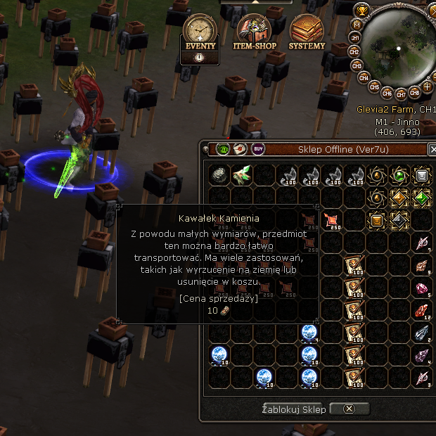
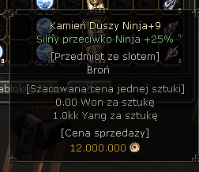

# Przykład działania — jeden sklep od zrzutu do zwalidowanego rekordu

Poniżej **prawdziwe dane z jednego uruchomienia**: jeden sklep (sprzedawca „Ver7u"),
od tego, co program widzi na ekranie, do uporządkowanych, zwalidowanych rekordów.

---

## 1. Wejście: zrzut sklepu

Program samodzielnie wykrył i otworzył sklep, a następnie dla każdego przedmiotu
najeżdża kursorem i zapisuje dymek z ceną.

> „Sklep Offline (Ver7u)", 48 zajętych slotów. Obraz jest zaszumiony i zatłoczony —
> stragany w tle, efekty, półprzezroczyste dymki. To jest realne, trudne wejście.

---

## 2. Jeden przedmiot z bliska: zdjęcie → odczyt

Tak wygląda pojedynczy dymek, który trafia do odczytu (OCR + model wizyjny):

Z tego obrazka system wyciąga i **uzgadnia dwa niezależne odczyty** (OCR i model wizyjny),
a potem waliduje wynik:

| Przedmiot | Ilość | Cena/szt (Yang) | Cena łączna (Yang) | Dowód | Status |
|---|---:|---:|---:|---|---|
| Kamień Duszy Ninja+9 | 12 | 1 000 000 | 12 000 000 | VLM + OCR | ✅ verified |

> Zgadza się co do grosza z tym, co widać na dymku: *„1.0kk Yang za sztukę"* → 1 000 000,
> *„Cena sprzedaży 12.000.000"* → 12 000 000.

---

## 3. Wynik: zwalidowane rekordy z tego sklepu

Po przejściu całego sklepu (48 slotów) system oddał **13 unikalnych, zwalidowanych
pozycji**. Najwartościowsze:

| Przedmiot | Ilość | Cena/szt (Yang) | Cena łączna (Yang) | Dowód | Status |
|---|---:|---:|---:|---|---|
| Odłamek Metina (4)      | 260 | 1 200 000  | 312 499 750 | konsensus grupy | ✅ verified |
| Dusza Niebios           |   4 | 57 000 000 | 228 000 000 | VLM + OCR       | ✅ verified |
| Pergamin Zwierzaka      |  10 | 14 000 000 | 140 000 000 | VLM             | ✅ verified |
| Fragment Pierścienia    | 100 |  1 000 000 | 100 000 000 | VLM             | ✅ verified |
| Kamień Duszy Ninja+9    |  12 |  1 000 000 |  12 000 000 | VLM + OCR       | ✅ verified |
| Kamień Duszy Uniku+9    |   4 |  1 000 000 |   4 000 000 | VLM + OCR       | ✅ verified |
| Kamień Duszy Szamana+9  |   3 |  1 000 000 |   3 000 000 | VLM + OCR       | ✅ verified |
| Kamień Duszy Obrony+9   |   2 |  1 000 000 |   2 000 000 | VLM + OCR       | ✅ verified |

*(…i 5 kolejnych pozycji)*

Do pliku `ceny.csv` trafiają **tylko rekordy ze statusem `verified`**.

---

## 4. Dlaczego to nie jest naiwne przepisywanie tekstu

Najciekawsze dzieje się w walidacji — i to był główny problem inżynierski, który
rozwiązywałem, kierując AI:

- **Dwa niezależne odczyty zamiast jednego.** Sam OCR się myli (w innym slocie odczytał
  cenę *20 000* zamiast *20 000 000* — model wizyjny to wyłapał). Rekord wchodzi pewniej,
  gdy oba źródła się zgadzają (`VLM + OCR`).
- **Walidacja odrzuca niepewne.** Z tego jednego sklepu **8 pozycji trafiło do „review"**
  (np. brak ceny jednostkowej), zamiast wejść do danych z błędem. System woli **nie zapisać**
  niż zapisać śmieci.
- **Konsensus grupy.** Ten sam przedmiot leżący w kilku slotach jest uzgadniany między
  kopiami — to łapie pojedyncze błędne odczyty.

To jest różnica między „program przepisał tekst z ekranu" a „program zebrał dane, którym
można zaufać".
